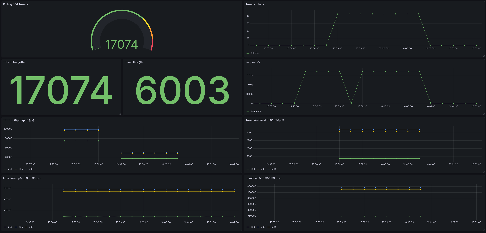

# TokenSiren

TokenSiren is an experimental observability pipeline for LLM inference runtimes built using eBPF uprobes.

It captures request lifecycle and token emission telemetry directly from the inference server process with near-zero overhead and exports structured metrics to Prometheus and Grafana.



TokenSiren instruments LLM inference runtimes at the kernel level to measure request lifecycle events, token throughput, and latency distributions without compromising the serving hot path.

The current repository provides a working end-to-end prototype targeting vLLM.

## Status

This repo implements a minimal pipeline: attach uprobes to vLLM symbols, collect per-request timing in eBPF maps, and expose metrics via a Prometheus endpoint. The remaining gaps are around production hardening and richer request correlation.

## Problems to solve
Modern LLM inference systems expose limited runtime visibility into token throughput, request latency distributions, and per-request stream behavior during generation.

TokenSiren addresses this gap by separating kernel-resident event collection from userspace metric export, allowing request lifecycle events to be captured with minimal overhead on the inference hot path.

## Current Architecture

At a high level the system is split into a kernel data plane and a Go userspace control plane.

```
vLLM runtime
      │
   uprobes
      │
   eBPF program
      │
   BPF maps
      │
Go control plane
      │
 Prometheus / OTLP
      │
   Grafana
```

### Kernel data plane

The eBPF program is defined in `bpf/tracer.c` and `bpf/common.h`. It defines map schemas and probe handlers for request start, token emit, and request end.

Maps currently defined:
- `active_streams` LRU hash for per stream timing state
- `conn_index` hash for optional transport to stream correlation
- `metric_buckets` hash for counters and histogram buckets
- `control` array for runtime tuning knobs

Handlers:
- `handle_request_start`
- `handle_token_emit`
- `handle_request_end`

These handlers record timestamps, compute simple latency histograms, and update `metric_buckets` based on the schemas in `bpf/common.h`.

### Userspace control plane

The Go side wires runtime resolution, probe attachment, and metric export.

Flow today:
1. `cmd/tokensiren/main.go` builds a `runtime.VLLMConfig`
2. `internal/runtime/vllm.go` maps that config into a `probes.AttachSpec`
3. `internal/probes/attach.go` loads the BPF object and attaches uprobes
4. `internal/exporter/prometheus.go` reads BPF maps and exposes `/metrics`

### Metrics model

The planned latency histogram buckets live in `internal/metrics/buckets.go` as microsecond boundaries that match the architecture draft.

## Repository layout

```
cmd/tokensiren/          entrypoint wiring
internal/runtime/        runtime resolution for vLLM
internal/probes/         probe attachment interfaces and handles
internal/exporter/       Prometheus exporter
internal/metrics/        histogram bucket definitions
bpf/                     eBPF program and shared schema
dashboards/              Grafana dashboard JSON
examples/                Prometheus scrape config
gen/                     build outputs (e.g. tracer.o)
upstream/                vLLM patch artifacts
docs/symbol-table-lookup.md   symbol discovery notes
docs/tokensiren_architecture.md design notes
```

## Why this matters

This codebase is an example of how to frame a kernel level telemetry pipeline for LLM serving. It shows:
- kernel side map and schema design for high cardinality request and token timing
- a minimal userspace control plane that composes runtime discovery, probe attachment, and metric export
- strict separation between the kernel data plane and the Go services that expose metrics

## Next engineering steps

Near term work is focused on tightening the prototype into a robust vLLM probe pipeline:
- add stable request identifiers and stream correlation (beyond pid-based keys)
- harden symbol resolution across vLLM versions and build variants
- add richer labels and metadata on the metrics surface
- add a model label only when there is a reliable source (avoid polling or a new control plane service in v1)
- improve error handling and lifecycle management around probe attachment

## vLLM stream instrumentation and patch (start, emit, end)

While instrumenting vLLM it became necessary to identify stable lifecycle boundaries for request start, token emission, and request completion.

Tracing the streaming execution paths revealed that the final request completion signal was only represented as a "[DONE]" sentinel emitted from Python generator control flow.

TokenSiren requires explicit request start, token emit, and request completion events in order to construct accurate latency distributions and throughput metrics without relying on inference runtime internals.

To expose these lifecycle boundaries without relying on brittle generator heuristics, a minimal set of hooks was introduced in the vLLM runtime. 

These hooks expose stable C++ symbols inside the vLLM extension module, allowing TokenSiren to attach uprobes without depending on Python control flow.

Files touched (why and where):

- `vllm/csrc/torch_bindings.cpp` and `vllm/csrc/cpu/torch_bindings.cpp`: export no-op C++ symbols `stream_start_hook()`, `stream_emit_hook()`, `stream_end_hook()` and register the corresponding custom ops so each hook is stable and probeable in the C++ extension.
- `vllm/entrypoints/utils.py`: provides small Python wrappers that invoke the custom ops with a dummy tensor.
- Streaming entrypoints (OpenAI completions, chat completions, responses API, speech-to-text, Anthropic messages): call `stream_start_hook()` when streaming begins, `stream_emit_hook()` before each SSE chunk is yielded, and `stream_end_hook()` right before emitting the terminal `[DONE]`.

Benefit vs Python-only approaches:

- avoids brittle “[DONE]” parsing or generator lifecycle hooks in external tooling
- provides stable uprobe targets for start, token emit, and request completion
- minimizes overhead (one no-op op call per event)
- keeps all three events in the API server process, avoiding cross-process correlation issues

The patch is stored here:

- `./upstream/stream_hooks.patch`

Issue reference (vLLM):

```
https://github.com/vllm-project/vllm/issues/37086
```

## Local runbook (patched vLLM)

1) Apply the upstream patch in your vLLM clone and rebuild the Python extension.
   - CPU dev rebuild (from vLLM docs):
     ```bash
     VLLM_TARGET_DEVICE=cpu uv pip install -e . --no-build-isolation
     ```
   - If you are already using a venv without `uv`, use your existing `pip` and keep the same env vars.
2) Run the vLLM OpenAI API server on CPU (example uses port 8999).
3) Start TokenSiren with symbols pointing at `vllm/_C.abi3.so` and the three stream hooks.
   - Optional labels: `TOKENSIREN_RUNTIME_LABEL` (default: `vllm`), `TOKENSIREN_HOST_LABEL` (default: hostname).
4) Scrape `http://<IP ADDRESS>/metrics` to validate TTFT, intertoken, duration, and tokens.
5) Point Prometheus at the TokenSiren metrics endpoint (see `examples/prometheus.yml`) and add that Prometheus instance as a Grafana data source.

Config reference:
- `docs/.env.example` (env var template)

Notes:
- The hooks are device-agnostic in theory because they live in the Python/C++ extension module used by the API server. This workflow has only been validated on CPU here; GPU should work if the API server loads the same extension module, but that is not validated in this repo.
